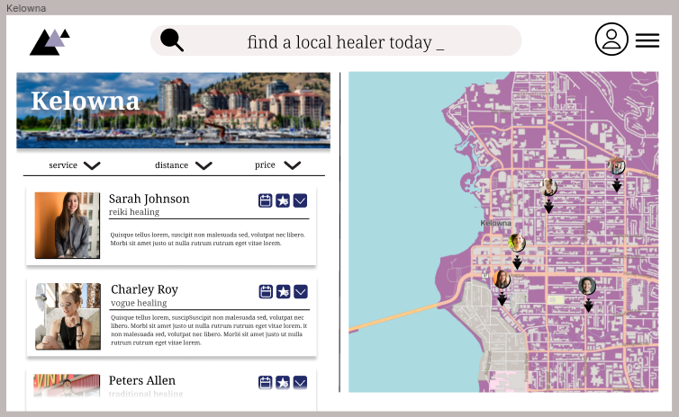
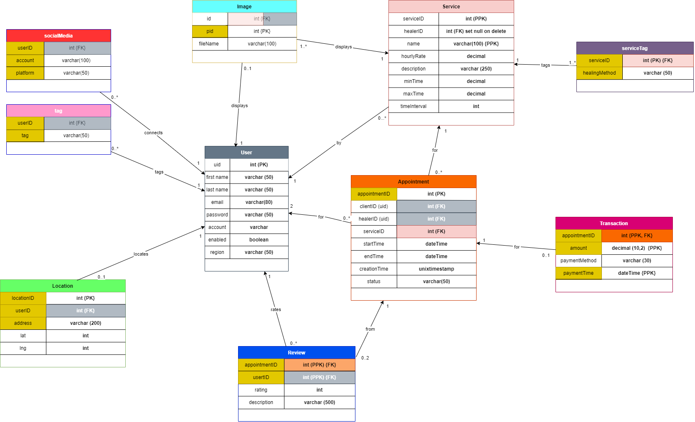

# BACK END

## Introduction
The `backend` folder contains the files for the API. The API is relatively simple and is built using Express, Sequilize, and MySQL. *You must ensure the XAMP is running before trying to initialize the database*. 

## Table Of Contens

*BACKEND*

TEch Stack
    ↳ [Express](#Express)
    ↳ [MySQL](#MySQL)
    ↳ [Sequelize](#Sequelize)

Documentation
    ↳ [Setup](#Setup)
    ↳ [To Do](#To-Do)
    ↳ [Adding To The Api](#Adding-To-The-API)

Folder Structure
    ↳ [Config](#Config-Data)
    ↳ [Controllers](#Controllers)
    ↳ [Middleware](#Middleware)
    ↳ [Models](#Models)
    ↳ [Routes](#Routes)
    

## TECH STACK

### Express
#### Overview
*Express.js* is used to create the backend server that the fronend communicates with. This server listens on port *localhost:8080* on this DEV enviroment. Ensure that this port is not the same port the frontend is using. ALso ensure that the frontend is sending requests to this port when it attempts to retrieve data from the API. 

#### Configuring the Express.js server
To change the server port and listening ports for the backend edit the **corsOptions** and **PORT** variables in the [server.js](/server.js) file. 

#### Adding To The API
Adding new tables to the SQL database will mean you will need to update the routes for the API. This has a cascade effect. Small and simple changes must be made to several files> Don't fret they're easy to make, adding new tables and defining their routes is simple. But it is time consuming. Details on how to do so require their own section highlighted [here](#Adding-To-The-API)

### MySQL 
The relational SQL database is populated by the the SEQUALIZE models defined in the [/models](/App/Backend/app/models) folder.  We focused on creating an effecient relational model using good design principles that minimize table redundency and NULL values. The model is consistent and seems to be without error at the moment. Improvements can be made. 

UML Diagram Database was built using

### Sequelize 
The relational SQL database is populated by the the SEQUALIZE models defined in the [/models](/App/Backend/app/models) folder.  We focused on creating an effecient relational model using good design principles that minimize table redundency and NULL values. The model is consistent and seems to be without error at the moment. Improvements can be made. 

## Documentation

### Setup 
0) Start XAMP. Ensure MYSQL is enabled. 
1) npm install
2) npm start
3) Test Endpoints using either the frontEnd or [Postman](/Testing) 

NOTE: Frontend and Backend must not be on the same port. If you start the backend first, ensure it is on any port but localhost:3000. 

## To Do
1) Adding additional tables outlined in the [UML DIAGRAM](../../Documentation/uml/updated_database.png) diagram that are required to enable features like commenting and reviews
2) Connect the Booking and Scheduling APIS selected by 2 teams responsible for those goals

## Adding To The Api
To Add to the API follow these Step by step instructions

1) Add `require("./app/routes/[TABLE-NAME].routes")(app);` to [server.js](/server.js) 
2) Add `[TABLE-NAME].routes.js` file to the [/app/routes](/App/Backend/app/routes) folder. 
2.1) Reffrencing other `.routes.js` files, document the appropriate API endpoints for the date users will retrieve from the new table in the newly created `[TABLE-NAME].routes.js`
3) 

