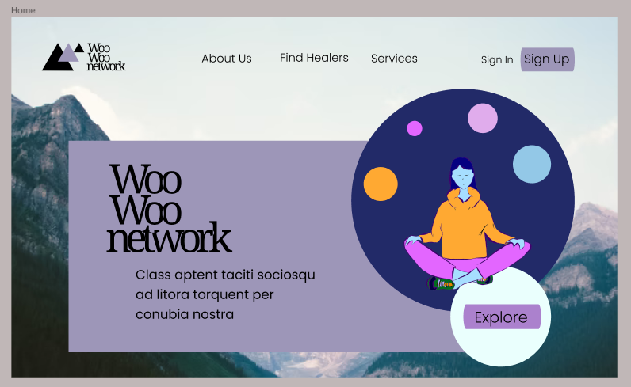

# FRONT END

## Introduction
The `frontend` folder contains the files for the Node.js and React project. The design files used to outline page flow can be dound in the documentation folder. The front end consits of 4 main pages and the interactive flows that follow from them for registering or selecting and booking. Page previews can be seen below. 

## Page Flow

*FRONTEND*
    ↳ [Home](#Home-Page)
    ↳ [Login](#Login)
    ↳ [Login](#Register)
    ↳ [SearchForHealer](#Search-For-Healer)
      ↳ [ViewHealer](#View-Healer)
      ↳ [ViewHealerCalendar](#View-healer-Calendar)
      ↳ [BookWithHealer](#Pay-healer)

## Setup 
1) npm install
2) npm start
3) go to localhost 3000 

NOTE: Frontend and Backend must not be on the same port. If you start the backend first, ensure it is on any port but localhost:3000. 

## To Do
1) Website is not currently mobile friendly
2) Booking API not connected to the frontend
3) Payment API not connected to the frontend
4) Secure state for logged in users not built
5) Register In Page not built
6) Frontend needs to be connected to the already built and defined API endpoints

## Page Preview

### Home Page
**COMPLETE:** Where the user lands on the site. Designed to be friendly and simple. There is room to add an about us page on the navbar or dynamically scrolling down on the homepage to reveal details about the platform. 

### Login
**COMPLETE:** Allows the user to enter their password and email to login to the platform. The login page for admin, clients, and healers is all the same. The backend dynamically handles navigating them to the appropraite next page, and controlling their acces and view of the platform. 

### Register
**NOT COMPLETE:** Prospective users of the site opt to create either a client or healer account on this page. Healer and clients have different forms they are required to submit to register. 

*Initial Register page. Users are prompeted to select a user-type to register*

*Clients and healers both are directed to this first registration page*

*Healers only, are directed to this second registration page*

*Healers last registration page*

### Search For Healer
**COMPLETE:** Accesible without loging in. Users browser's IP location can be used if availible to find healers near them. Otherwise, the default city of Vancouver is selected. Users can use dropdowns to select a new region to browse for healers in. Healers details are displayed in a column on the left. Their approximate location is show on a google map on the right. *the calendar and booking apis are not connected*

*The map page is the initial page users are brought to when they click the 'find healer button'*

### View healer
*The healer profile page is where users are taken once they double click on a healer'*

### View healer Calendar
*The calendar to book with pops up when the user selects the booking option on the healer profile'*

### Pay healer
*The calendar to book with pops up when the user selects the booking option on the healer profile'*

