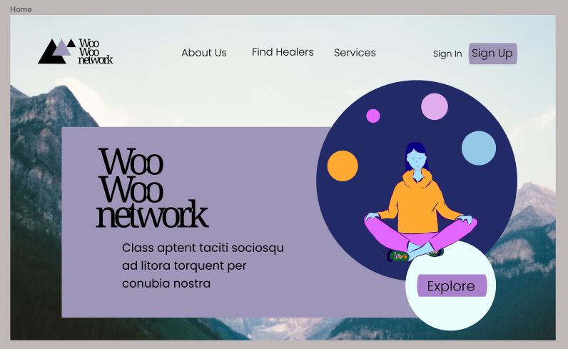

# The Woo Woo Network

## Introduction
The Woo Woo Network is an online marketplace aimed at connecting spiritual healers with people seeking spiritual healing services.

This repository contains the work of COSC499-Group 2's work for the term. It's a full stack CRUD webapp using Node.js, React, Express, and MySQL. 

## Evaluation
Please navigate to [Documentation/scrumtemplates](/Documentation/scrumtemplates) and click on the latest ScrumTemplate.pdf to evaluate our weekly progress. Thank you.

## Program Structure
```rb
PROJECT
    ↳ App
    ⏐  ↳ Frontend
    ⏐  ↳ Backend
    ⏐  ↳ Dashboard
    ↳ Documentation
    ↳ Testing
```
## FILE PATHS
- [Frontend](/App/Frontend): The Node.js and React frontend. Styled using vanilla CSS.
- [Dashboard](/App/Dashboard): The PHP dashboard for W.W.N. admini to manage the app's content.
- [Backend](/App/Frontend): The Express and MySql backend. Designed as an REST API for the frontend to use.
- [Documentation](/Documentation): All Project Documentation, Screentshots, sql setup queries and more.
- [Testing](/Testing): POSTMAN collections used to document the API live here. 


## Setup
To run the app, you must start up the Frontend, Backend-API, and dashboard seperatly. Details on how to do so are listed in the README.md found in each of their respective folders. Follow to the links below for more instructions. We suggest initializing the Backend, Frontend, and Dashboard, in that order. 

1) [Frontend](/App/Frontend)
2) [Dashboard](/App/Dashboard) 
3) [Backend](/App/Backend)


## Peer Testing Setup (just run the front end)
1) cd to frontend
2) npm install
3) npm start
4) go to localhost 3000 
