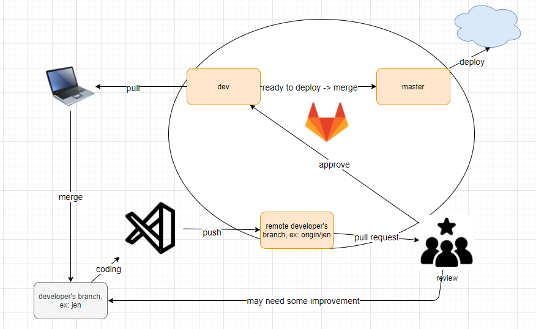

# The Unforgotten Ones

> The capstone project developed by The Unforgettables team.

## Overview
The web application connects patients and healers, which allows patients book appointment with available healers on the platform.

## Technologies
This code base is front-end of the platform. It is built by:
- [React](https://reactjs.org/)
- [Material-UI](https://material-ui.com/)
- [Create-react-app](https://create-react-app.dev/docs/getting-started/)
- [Eslint](https://eslint.org/) and [Prettier](https://prettier.io/) for linting and formatting.
- [React router](https://reactrouter.com/web/guides/quick-start)

## Directory structure

> - `src/` contains the main implementation files
>    - `components/` contains react components
>        - `[component-name]` a folder of a component
>            - `index.jsx`  the main jsx file
>            - `[component-name.test.js]` a test file
>    - `pages/` contains page components 
>    - `hooks/` contains custom hooks for components
>    - `router.js` contains router configuration codes
> - `public/` contains public files, such as logo, image files

## Naming conventions

### File names
- File name should be lowercase, each word is separated by `'-'`. For example: 'user-input.jsx'
- Component file and test name should reflect related component name

### Component names
- Component name should be CamelCase. Always start component names with a capital letter. For example: 'UserInput'
- Component name structure: `[context][sub component][main component]`. Note: context and sub component may be optional.

## Git branches and workflow
### Git branches
- `master`: the main branch for production. The code in the master branch should be ready to deploy
- `dev`: the main branch of development stage.
- [developer name] branch: developer's local branch. For example: jen, ryan or isa.
### Workflow

## Reference

## Available Scripts

In the project directory, you can run:

### `npm start`

Runs the app in the development mode.\
Open [http://localhost:3000](http://localhost:3000) to view it in the browser.

The page will reload if you make edits.\
You will also see any lint errors in the console.

### `npm test`

Launches the test runner in the interactive watch mode.\
See the section about [running tests](https://facebook.github.io/create-react-app/docs/running-tests) for more information.

### `npm run build`

Builds the app for production to the `build` folder.\
It correctly bundles React in production mode and optimizes the build for the best performance.

The build is minified and the filenames include the hashes.\
Your app is ready to be deployed!

See the section about [deployment](https://facebook.github.io/create-react-app/docs/deployment) for more information.

### `npm run eject`

**Note: this is a one-way operation. Once you `eject`, you can’t go back!**

If you aren’t satisfied with the build tool and configuration choices, you can `eject` at any time. This command will remove the single build dependency from your project.

Instead, it will copy all the configuration files and the transitive dependencies (webpack, Babel, ESLint, etc) right into your project so you have full control over them. All of the commands except `eject` will still work, but they will point to the copied scripts so you can tweak them. At this point you’re on your own.

You don’t have to ever use `eject`. The curated feature set is suitable for small and middle deployments, and you shouldn’t feel obligated to use this feature. However we understand that this tool wouldn’t be useful if you couldn’t customize it when you are ready for it.

## Learn More

You can learn more in the [Create React App documentation](https://facebook.github.io/create-react-app/docs/getting-started).

To learn React, check out the [React documentation](https://reactjs.org/).

### Code Splitting

This section has moved here: [https://facebook.github.io/create-react-app/docs/code-splitting](https://facebook.github.io/create-react-app/docs/code-splitting)

### Analyzing the Bundle Size

This section has moved here: [https://facebook.github.io/create-react-app/docs/analyzing-the-bundle-size](https://facebook.github.io/create-react-app/docs/analyzing-the-bundle-size)

### Making a Progressive Web App

This section has moved here: [https://facebook.github.io/create-react-app/docs/making-a-progressive-web-app](https://facebook.github.io/create-react-app/docs/making-a-progressive-web-app)

### Advanced Configuration

This section has moved here: [https://facebook.github.io/create-react-app/docs/advanced-configuration](https://facebook.github.io/create-react-app/docs/advanced-configuration)

### Deployment

This section has moved here: [https://facebook.github.io/create-react-app/docs/deployment](https://facebook.github.io/create-react-app/docs/deployment)

### `npm run build` fails to minify

This section has moved here: [https://facebook.github.io/create-react-app/docs/troubleshooting#npm-run-build-fails-to-minify](https://facebook.github.io/create-react-app/docs/troubleshooting#npm-run-build-fails-to-minify)
