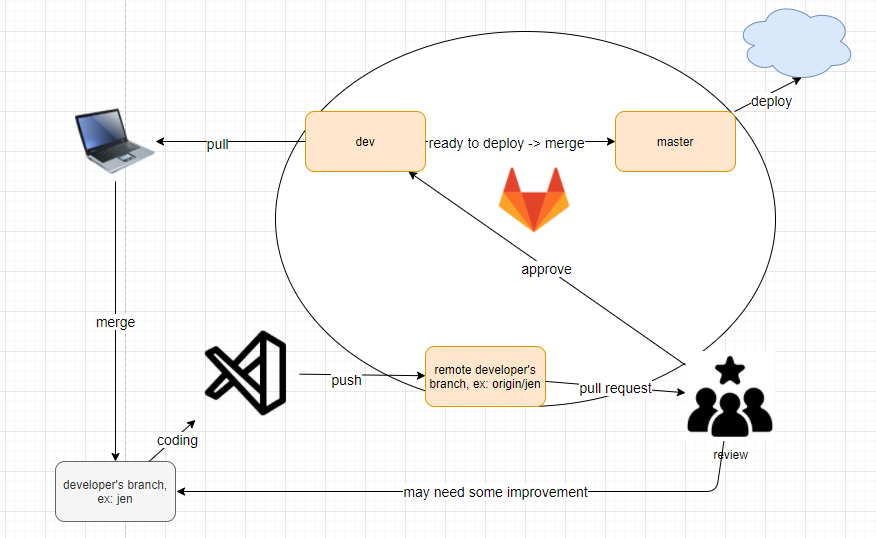

# The Woo Woo Net

> The capstone project developed by The Unforgettables team.

## Overview

The web application connects patients and healers, which allows patients book appointment with available healers on the platform.

## Technologies

This code base is front-end of the platform. It is built by:

- [Express](https://expressjs.com/)
- [SQLite3](https://sqlite.org/index.html) For development
- [Postgresql](https://www.robinwieruch.de/postgres-express-setup-tutorial) For production
- [Sequelize](https://sequelize.org/) ORM library for SQL
- [Babel](https://babeljs.io/) For transpile code from ES6 to ES5
- [Firebase](https://firebase.google.com/) Services to handle authentication
- [Eslint](https://eslint.org/) and [Prettier](https://prettier.io/) for linting and formatting.

## Directory structure

In this project, we will use Model-View-Controller pattern

## Naming conventions

### File names

- File name should be all lowercase, each word is separated by `'-'`. For example: 'user-controller.js'

### Syntax

We will use ES6 syntax, as Babel already handle transpile to ES5.

## Git branches and workflow

### Git branches

- `master`: the main branch for production. The code in the master branch should be ready to deploy
- `dev`: the main branch of development stage.
- [developer name] branch: developer's local branch. For example: jen, ryan or isa.

### Workflow

## Installation

- Fork the repository and go to project folder
- Pull `dev` branch with `git pull origin dev`
- Run `npm ci` to install all dependencies
- create .env file at the root folder of the project and at the keys to the folder. Will have the key instruction below (update soon)
- If the project is already installed before and still under development, please make sure to delete `dist` and `db.splite3`
- Run `node_modules/.bin/sequelize db:migrate` to set up the database
- Run `node_modules/.bin/sequelize db:seed:all` insert seeding data to database
- Make sure to have folder `/public/photos` at the root folder of the code base. If not, created one by typing `mkdir /public/photos` on the terminal.
- Run `npm run watch` to run the server
- Send request to `http://localhost:8000/`

## Sequelize commands reference

- `node_modules/.bin/sequelize model:generate --name User --attributes firstName:string,lastName:string,email:string` : create User table with firstName, lastName and email columns -> generate User model and migration file
- `node_modules/.bin/sequelize db:migrate` : run migration file to update database structure
- `node_modules/.bin/sequelize seed:generate --name seed-user` generate seeding file to seed user data
- `node_modules/.bin/sequelize db:seed:all` insert seeding data to database

- **Note** should delete `db.sqlite3` file if changing the database structure

## Reference

- [https://dev.to/richienabuk/setting-up-express-js-rest-api-postgres-and-sequelize-orm-with-es6-4m08](https://dev.to/richienabuk/setting-up-express-js-rest-api-postgres-and-sequelize-orm-with-es6-4m08) -[https://github.com/lotivo/sequelize-guard#user-model-api](https://github.com/lotivo/sequelize-guard#user-model-api)
- [SQLite and Sequelize](https://stackabuse.com/using-sequelize-js-and-sqlite-in-an-express-js-app/)
- [Firebase Auth](https://dev.to/emeka/securing-your-express-node-js-api-with-firebase-auth-4b5f)
- [https://gist.github.com/vapurrmaid/a111bf3fc0224751cb2f76532aac2465](https://gist.github.com/vapurrmaid/a111bf3fc0224751cb2f76532aac2465)
